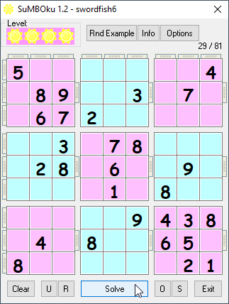

# Game_SuMBOku
## just another attempt to the sudoku game  
I tried to make the game idea work 
* you can note your guesses on possible solutions for every column, row or 9-block just like you would do it on paper
* if you stuck for any reason you can cheat by clicking the solve button to get a clue
* you can then undo your cheating and try it yourself again
* you can undo and redo everything 
* there are some sudoku games included inside the program, just click the "Rnd Example" button
* you can open external sudoku games (in *.ss-files) and save your game state

project started around 2004 
it came to it's last (but not least) version in february 2006

for compiling it you will also need the project "Win_Dialogs" you can find it [here](https://github.com/OlimilO1402/Win_Dialogs).  

